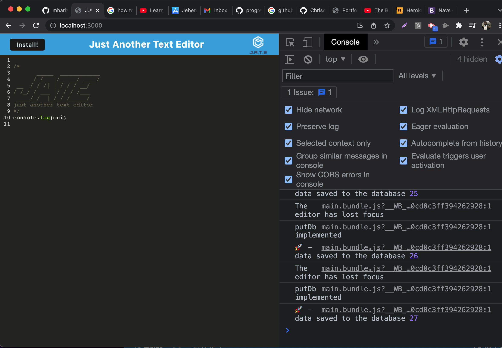

# Text-Editor

## Description
Text editor  is  a Progressive Web App which runs in the browser with a number of data persistence measures serving as redundancy in case one of the options is not supported by the browser, or online connectivity is lost. The app uses the idb package methods to get and store data to an IndexedDB database.

## Core Skills

* Node.js
* Express.js
* JavaScript
* Workbox
* Service Worker
* IndexedDB API
 

## Mock-Up

## Review

* Link to Aplication deployed
  * https://frozen-brook-84861.herokuapp.com/

* The URL of the GitHub repository 
* [Repository](https://github.com/Chrisolsen1993/Text-Editor)
